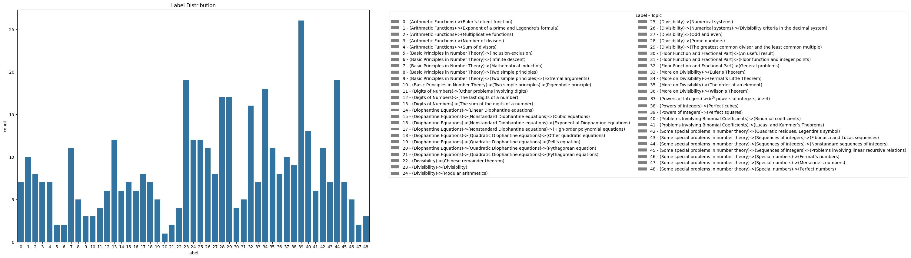
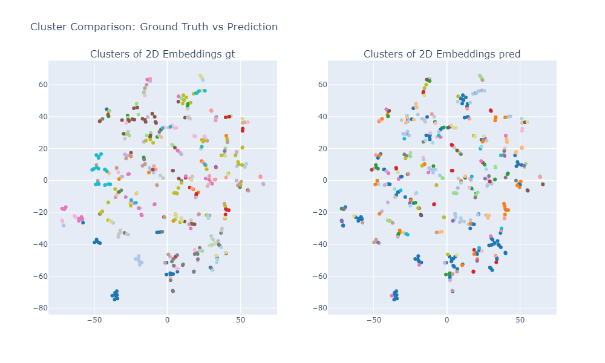

# Math Problem Recommender

A machine learning system that recommends relevant math problems based on semantic similarity.

## What It Does

This system helps match students with appropriate math problems by analyzing the semantic meaning of problems and finding similarities between them. When a student struggles with or excels at a particular problem, the system can recommend similar problems to reinforce learning or provide appropriate challenges.

## Datasets
- **Titu Andreescu 104 Number Theory Problems.** Textually rich problems with solutions and some sort of topic classification.

- **Benchmark.** Manually engineered benchmark to test performance of the model. Consists of 1 anchor problem and 3 problems that has to be ranked. Also has query that indicates similarity, as by labeler's opinion.

Custom made tool to speed up labeling process.
## Technologies Used

- **Sentence Transformers**: Creates semantic embeddings of math problems, capturing their meaning beyond simple keyword matching
- **Community Detection Algorithms**: Groups similar problems into clusters based on their embeddings
- **TSNE**: Reduces high-dimensional embeddings to 2D for visualization
- **TSDAE**: Domain adaptation technique
- **Scikit-learn**: Provides metrics for evaluating clustering quality
- **Plotly**: Creates interactive visualizations of problem clusters

## Strategies Used

1. Clustering similar problems with community detection algorithms based on text embedding;

2. Embedding math problems using transformers and computing similarity score of CLS tokens. TSDAE used for fine-tuning.
3. Prompt engineering with NLI pipeline.